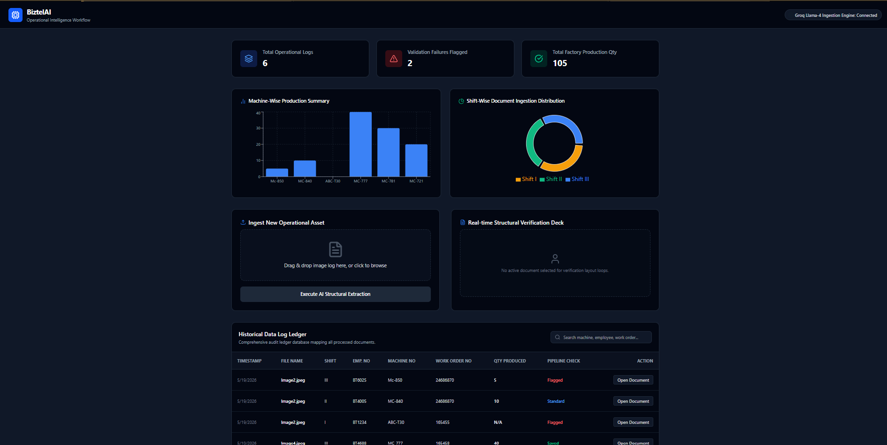

# BiztelAI – AI-Powered Manufacturing Workflow Automation

AI-powered system that digitizes handwritten manufacturing logs into structured operational records using OCR + Vision LLM pipelines.

---

## 🚀 Features

- Upload handwritten images/PDFs
- AI-based field extraction using Groq Llama-4 Vision
- Editable review workflow
- Field-level confidence highlighting
- Validation & exception detection
- Dashboard analytics
- Search & upload history

---

## 🧠 AI Extraction Workflow

```text
Document Upload
      ↓
OCR + Vision LLM
      ↓
Structured JSON Records
      ↓
Validation Engine
      ↓
Human Review
      ↓
Database Storage
```

---

## ✅ Validation Rules

- Invalid shift detection
- Missing mandatory fields
- Duplicate work order detection
- Invalid machine number formats
- Suspicious quantity values

---

## 📊 Dashboard Preview

### Analytics Included
- Total uploads
- Validation failures
- Shift-wise summaries
- Machine-wise production
- Quantity analytics

---

## 📸 Screenshots

### Dashboard




---

# 🏗️ Tech Stack

## Frontend
- React (Vite)
- Tailwind CSS v4
- Recharts

## Backend
- Node.js
- Express.js
- Multer

## Database
- MongoDB

## AI Pipeline
- Groq Llama-4 Vision

---

# ⚙️ Environment Variables

Create a `.env` file inside `backend/`

```env
PORT=5000

MONGO_URI=mongodb://127.0.0.1:27017/biztelai_db

GROQ_API_KEY=your_groq_api_key
```

---

# 🚀 Local Setup

## Backend

```bash
cd backend
npm install
npm run dev
```

---

## Frontend

```bash
cd frontend
npm install
npm run dev -- --force
```

Frontend runs at:

```text
http://localhost:5173
```

---

# 📂 Project Structure

```text
biztelai/
│
├── frontend/
├── backend/
├── screenshots/
├── README.md
├── AGENTS.md
└── AI_WORKFLOW.md
```

---

# ⚖️ Assumptions & Tradeoffs

- Local MongoDB used for faster evaluation setup
- Lightweight confidence indicators used instead of OCR bounding-box systems
- Focused on rapid MVP execution and operational usability

---

## ⭐ Support the Project
If you like this AI-powered operational automation engine, feel free to give this repository a **Star**! It helps keep the development motivation high.